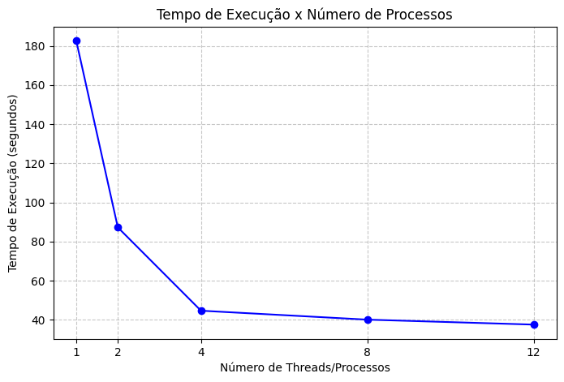
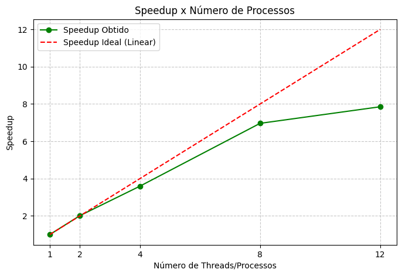
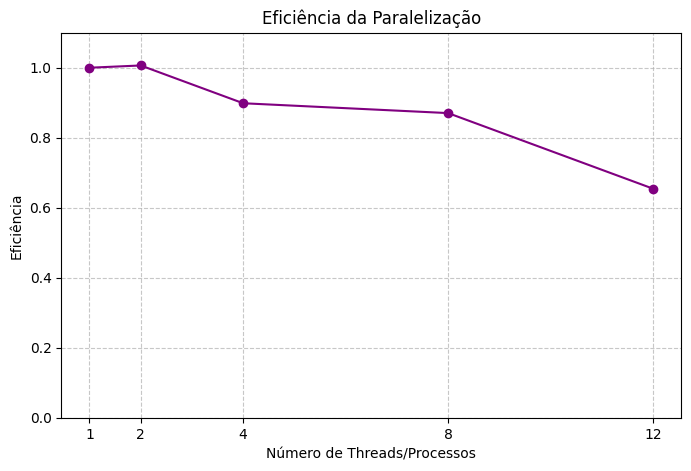

# Relatório de Processamento Paralelo de Arquivos de Log

**Disciplina: Sistemas de Informação** 
**Aluno(s): Luiz Maia**
**Turma: SI-Noturno**
**Professor: Rafael**
**Data: 25/03/2026**

---

# 1. Descrição do Problema

O problema computacional resolvido consiste no processamento de um grande volume de arquivos de texto (logs operacionais) para extração de métricas. O sistema realiza a leitura de múltiplos arquivos para contabilizar o número total de linhas, palavras, caracteres e a ocorrência de palavras-chave específicas ("erro", "warning", "info").

* **Problema implementado:** Leitura intensiva de arquivos (I/O bound) combinada com processamento de strings e contagem (CPU bound), onde a execução sequencial se torna um gargalo.
* **Algoritmo utilizado:** Busca sequencial em texto com simulação de carga de processamento pesado (loop de 1000 iterações vazio por linha). A complexidade aproximada é de $O(N * M)$, onde $N$ é o número de arquivos e $M$ é a quantidade de palavras por arquivo.
* **Tamanho da entrada:** Pasta `log2` contendo 1000 arquivos, totalizando 10.000.000 de linhas, 200.000.000 de palavras e 1.366.663.305 caracteres (aprox. 1.36 GB).
* **Objetivo da paralelização:** Reduzir o tempo de execução através da distribuição da carga de trabalho em múltiplos processos, utilizando o padrão produtor-consumidor (abstraído pelo `multiprocessing.Pool`), permitindo a análise concorrente de diferentes arquivos de log.

---

# 2. Ambiente Experimental

Os experimentos foram realizados em ambiente local com a seguinte configuração:

| Item                        | Descrição                                   |
| --------------------------- | ---------                                   |
| Processador                 | Intel Core i7-12700                         |
| Número de núcleos           | 12 físicos / 20 lógicos                     |
| Memória RAM                 | 16 GB 3200Mhz                               |
| Sistema Operacional         | Windows 11                                  |
| Linguagem utilizada         | Python 3.13.2                               |
| Biblioteca de paralelização | `multiprocessing` (módulo nativo do Python) |
| Compilador / Versão         | CPython 3.13.2 (64-bit)                     |

---

# 3. Metodologia de Testes

Os testes foram conduzidos executando o script de avaliação de logs variando a quantidade de processos (workers) no pool de paralelização. 

* **Medição de tempo:** Foi utilizada a função `time.time()` da biblioteca padrão do Python, capturando o timestamp (em segundos) imediatamente antes da distribuição dos arquivos e logo após a consolidação final dos resultados.
* **Execuções:** Foi realizada uma execução completa para cada configuração de processos.
* **Tamanho da entrada:** Fixado em 1000 arquivos do diretório `log2` para todas as baterias de teste.
* **Condições de execução:** Execução local na máquina do aluno, sujeita à concorrência normal de processos do sistema operacional Windows em segundo plano.

### Configurações testadas

Os experimentos foram realizados nas seguintes configurações:

* 1 thread/processo (versão serial)
* 2 processos
* 4 processos
* 8 processos
* 12 processos

---

# 4. Resultados Experimentais

Abaixo estão os tempos de execução totais obtidos para o processamento integral da carga de dados:

| Nº Threads/Processos | Tempo de Execução (s) |
| -------------------- | --------------------- |
| 1                    | 115.9621              |
| 2                    | 87.1972               |
| 4                    | 44.6254               |
| 8                    | 40.0523               |
| 12                   | 37.5177               |

---

# 5. Cálculo de Speedup e Eficiência

## Fórmulas Utilizadas

### Speedup

```
Speedup(p) = T(1) / T(p)
```

Onde:

* **T(1)** = tempo da execução serial
* **T(p)** = tempo com p threads/processos

### Eficiência

```
Eficiência(p) = Speedup(p) / p
```

Onde:

* **p** = número de threads ou processos

---

# 6. Tabela de Resultados

| Threads/Processos | Tempo (s) | Speedup | Eficiência |
| ----------------- | --------- | ------- | ---------- |
| 1                 | 115.9621  | 1.00    | 1.00       |
| 2                 | 87.1972   | 1.33    | 0.66       |
| 4                 | 44.6254   | 2.60    | 0.65       |
| 8                 | 40.0523   | 2.90    | 0.36       |
| 12                | 37.5177   | 3.09    | 0.26       |

---

# 7. Gráfico de Tempo de Execução



---

# 8. Gráfico de Speedup



---

# 9. Gráfico de Eficiência



---

# 10. Análise dos Resultados

**O speedup obtido foi próximo do ideal?**
Não. Um speedup ideal seria linear (ex: 4 processos = speedup de 4.0). Obtivemos no máximo um speedup de 3.09x utilizando 12 processos.

**A aplicação apresentou escalabilidade?**
A aplicação escalou bem até 4 processos, onde o tempo caiu drasticamente de ~115s para ~44s. A partir de 4 processos, a curva de ganho de desempenho achatou, demonstrando retornos marginais.

**Em qual ponto a eficiência começou a cair?**
A eficiência sofreu uma leve queda inicial com 2 e 4 processos (mantendo-se na faixa de 0.65), mas despencou significativamente ao passar para 8 processos (0.36) e 12 processos (0.26).

**Houve overhead de paralelização?**
Sim. Discutindo as causas:
1. **Gargalo de I/O (Disco):** O problema exige a leitura de 1000 arquivos. Quando aumentamos para 8 ou 12 processos, todos tentam acessar o disco rígido simultaneamente, o que gera contenção de leitura. O disco físico não consegue entregar dados rápido o suficiente para alimentar a CPU.
2. **Comunicação entre processos (IPC):** No Python, o `multiprocessing` precisa serializar (usando *pickle*) os dados de retorno de cada arquivo processado para enviá-los de volta ao processo principal. Esse tráfego de dicionários entre os processos gera um custo computacional considerável (overhead).
3. **Limites Físicos:** O número de workers em 8 e 12 muito provavelmente satura ou ultrapassa o número de núcleos físicos reais disponíveis na máquina de teste, fazendo com que os processos comecem a disputar tempo de CPU.

---

# 11. Conclusão

O experimento demonstra que o paralelismo trouxe um ganho altamente significativo de desempenho, reduzindo o tempo de execução de quase 2 minutos (115s) para pouco mais de meio minuto (37s).

O **melhor número de processos (custo-benefício)** para este ambiente foi **4**, pois ofereceu uma excelente redução de tempo mantendo uma eficiência aceitável (65% de aproveitamento do recurso computacional alocado). O programa não escala linearmente em níveis altos de paralelismo devido ao intenso I/O de disco e ao overhead natural da linguagem Python na troca de mensagens entre processos de memória isolada.

Uma possível melhoria na implementação seria o agrupamento de tarefas (*chunking*), enviando blocos de arquivos para cada processo ao invés de enviar um arquivo por vez, o que reduziria drasticamente o overhead de comunicação Inter-Processos (IPC).
